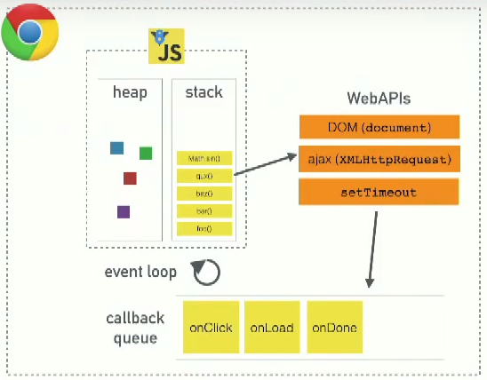

#OOP:

1. Object and Class
2. Encapsulation
3. inheritance, composition, aggregation
4. Poymorphism
5. Recursion
6. Design Patterns:
	+ Observer Pattern -> Pub/Sub -> publish/subscribe -> $on/$broadcast


## Javascript Development
+ Ecma Script - previous naming for JS development: ES3 -> ES5 -> ES6/JavaScript2015 -> ES7/JavaScript2016
+ Javascript[year] - new naming
+ ES5: there is no `class` keyword, there is one in Javascript ES6/Javascript2015


### What is JavaScript?
+ a single-threaded non-blocking asynchronous, concurrent language
+ 

## Objects and Classes in Javascript
+ in JavaScript, we don't have classes, only class-like functions or constructors
+ class example:

```javascript

	function Person(fname, lname) { // class name + fields or attributes
	
	// if u use this u could have access to these attribute from a prototyper function
		this.firstName = fname;
		this.lastName = lname;
		
	// using this solution u could only have access to them right here inside the constructor
		var firstName = fname;
		var lastName = lname;
		
	// methods
		this.getFullName0 = function(){
			return firstName + ' ' + lastName;
		};
	}


	// prototype function added to class Person
	Person.prototype.getFullName = function(){
		return this.firstName + ' ' + this.lastName;
	};

	var danielObject = new Person('Daniel', 'Hoksza');
	danielObject.firstName; // returns 'Daniel'
	danielObject.lastName; // returns 'Hoksza'
	danielObject.toString(); // returns '[object Object]'

	danielObject.getFullName0();//'Daniel Hoksza'
	danielObject.getFullName();//'Daniel Hoksza'

	var mehranObject = new Person('Mehran', 'Hatami');

	console.log(mehranObject.getFullName0 !== danielObject.getFullName0);// true
	console.log(mehranObject.getFullName === danielObject.getFullName);// true

```


## Inheritance

+ Inheritance Model in JavaScript is not based on classes it is based on prototypal inheritance
+ what has AngularJS/JavaScript/OOP in common? Inheritance, e.g. scopes have this relationship
+ you access parent of a scope by scope.parent

```javascript

	$rootScope.title = 'My App';
	$scope;
	console.log($scope.title);//My App
```

+ longer example demonstrating inheritance: 

```javascript

	var personObject = { 
		// personObject is like a $rootScope

		firstName: "Mehran",
		'lastName': "Hatami",
		'private address': ""
	};

	var teacherObject = Object.create(personObject);
		// teacherObject is like a $scope; $rootScope > $scope relationship

	teacherObject.field = 'Math'; // adding additional property to teacherObject
	teacherObject.schoolName = 'AnySchool'; // adding additional property to teacherObject

	var mathTeacherObject = Object.create(teacherObject); // literal way of creating an object
	// personObject > teacherObject > mathTeacherObject
	// $rootscope > $scope > $scope
	// another controller inside the other controller

	// inheritance demonstration
	mathTeacherObject.firstName; // returns "Mehran"
	mathTeacherObject.schoolName; // returns "AnySchool"

	// accessing parents demonstration
	mathTeacherObject.__proto__ === teacherObject;
	teacherObject.__proto__ === personObject;
	mathTeacherObject.__proto__.__proto__ === personObject;
```


## Ways of creating JavaScript object

+ read this on [StackOverflow](http://stackoverflow.com/a/21763808/2877719)

```javascript

	// empty object
	var obj = {};

	// an object with property
	var obj2 = { 	
		name: "OBJ2"
	};

	// an array object
	var array = []; //
	// not a good practice
	var array = new Array();
	
	// literal using Object.create(null) + some inheritance demonstration.

	var obj3 = Object.create(obj2); // returns empty object -> {}
	obj3.name2 = 'OBJ3';
	var obj4 = Object.create(obj3); // returns empty object -> {}
	obj4.name; // returns 'OBJ2'
	obj4.name2; // returns 'OBJ3'

	// a new object coming from the class-like functions/constructors
	var person = new Person();

```


## Encapsulation

+ pouzivani directive v AngularJS je dobry priklad, kde direktiva je modul, ktery jednoduse pripojim k aplikaci pouzivanim html tagu nebo attributu. 
+ Je to jako API. Teto direktive mohu dat attributy, ktere edituji jeji chovani nebo vzhled. Napriklad animace, jQuery kod...

```html

	<my-directive opacity="10"></my-directive>
```


## Design Patterns

+ read this [book](https://addyosmani.com/resources/essentialjsdesignpatterns/book/)
+ takto to chapu nebo nechapu:

	1. v AngularJS mam napriklad v $rootScope event *onUserChange*, ktera sleduje zmeny ve $scope1 a $scope2.
		```javascript

			$rootScope.$on('onUserChange', function(index){
				// do something
			});
		```

	2. $scope1 obsahuje seznam uzivatelu

		```javascript

			$scope.users = [a, b, c];
		```

	3. ve $scope2 je button na ktery kdyz koncovy uzivatel klikne, posle tim zpravu ostatnim $scopes.

		```javascript

			$scope.changeUser = function(index){
				$rootScope.$broadcast('onUserChange', index);
			};
		```

		```html
			<button ng-click="changeUser(3)"></button>
		```

+ pojmy k design patterns
	+ Observe an event or Observe a change or any thing, we observe using $on

	+ subscribe -> observables: $on (angular), .on()(jQuery), .addEventListener/.onclick/.onkeypress/... (JavaScript)
	+ publish -> observables: $broadcast, trigger, raise, publish


## Event Loop
+ watch this [video](https://www.youtube.com/watch?v=8aGhZQkoFbQ)
+ code example for async:
	```javascript

		setTimeout(function cb() {
			console.log('Hello');
		}, 5000);
	```

